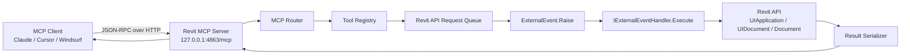
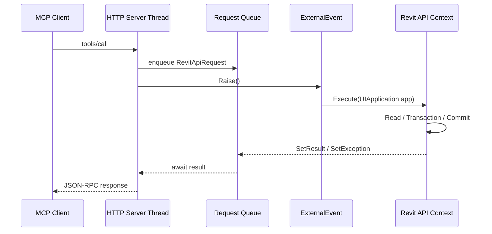
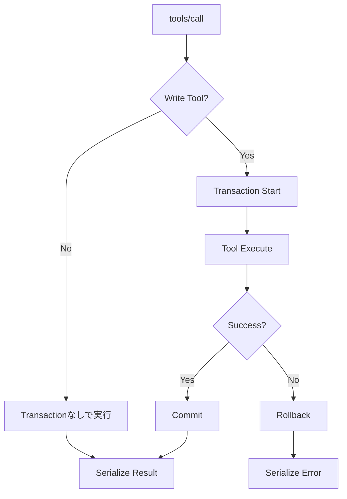
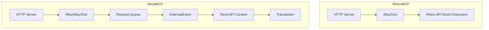

# Revit MCP 実装仕様書

## 1. 結論

RhinoMCP を参考に、Revit MCP は **Revit アドイン内で localhost HTTP MCP サーバーを起動し、MCP `tools/call` を Revit API 実行キューへ変換して `ExternalEvent` 経由で実行する構成** とする。

Rhino と異なり、Revit API は任意の HTTP 受信スレッドから直接呼び出せない。そのため、HTTP サーバーは MCP プロトコルの受付・JSON-RPC 解析・Tool ディスパッチまでを担当し、実際の Revit API 操作は `IExternalEventHandler.Execute(UIApplication app)` 内で実行する。

初期リリースでは以下を実装対象にする。

| 区分 | 実装対象 |
|---|---|
| Revit アドイン | Ribbon ボタン、起動・停止、設定読込 |
| MCP Server | `initialize`, `tools/list`, `tools/call` |
| 実行制御 | `ConcurrentQueue`, `ExternalEvent`, timeout |
| Tool | document info, selection get, element find, parameter get/set, wall create |
| 安全性 | localhost 固定、Origin 検証、write/destructive tool 制御 |

---

## 2. 全体構成



---

## 3. プロジェクト構成

```text
RevitMcp/
├─ src/
│  ├─ RevitMcp/
│  │  ├─ App.cs
│  │  ├─ Commands/
│  │  │  └─ RevitMcpCommand.cs
│  │  ├─ Server/
│  │  │  ├─ McpHttpServer.cs
│  │  │  ├─ McpRouter.cs
│  │  │  ├─ McpJsonRpc.cs
│  │  │  └─ McpSessionStore.cs
│  │  ├─ RevitExecution/
│  │  │  ├─ RevitApiRequest.cs
│  │  │  ├─ RevitApiRequestQueue.cs
│  │  │  ├─ RevitExternalEventHandler.cs
│  │  │  └─ RevitToolContext.cs
│  │  ├─ Tools/
│  │  │  ├─ IRevitMcpTool.cs
│  │  │  ├─ DocumentInfoTool.cs
│  │  │  ├─ SelectionGetTool.cs
│  │  │  ├─ ElementsFindTool.cs
│  │  │  ├─ ElementParametersTool.cs
│  │  │  ├─ SetParameterTool.cs
│  │  │  └─ WallCreateLineTool.cs
│  │  ├─ Config/
│  │  │  └─ RevitMcpSettings.cs
│  │  ├─ Logging/
│  │  │  └─ RevitMcpLogger.cs
│  │  └─ UI/
│  │     ├─ Ribbon.cs
│  │     └─ StatusPane.xaml
│  └─ RevitMcp.Tests/
├─ installer/
│  ├─ RevitMcp.addin
│  └─ install.ps1
└─ docs/
   ├─ client-config.md
   ├─ tools.md
   └─ security.md
```

---

## 4. Revit アドイン仕様

### 4.1 Add-in Manifest

```xml
<?xml version="1.0" encoding="utf-8" standalone="no"?>
<RevitAddIns>
  <AddIn Type="Application">
    <Name>Revit MCP</Name>
    <Assembly>C:\ProgramData\Autodesk\Revit\Addins\2026\RevitMcp\RevitMcp.dll</Assembly>
    <AddInId>PUT-GENERATED-GUID-HERE</AddInId>
    <FullClassName>RevitMcp.App</FullClassName>
    <VendorId>AQST</VendorId>
    <VendorDescription>AsiaQuest</VendorDescription>
  </AddIn>
</RevitAddIns>
```

### 4.2 `App.cs`

```csharp
using Autodesk.Revit.UI;

namespace RevitMcp;

public sealed class App : IExternalApplication
{
    public Result OnStartup(UIControlledApplication application)
    {
        RevitMcpRuntime.Initialize(application);
        Ribbon.Create(application);
        return Result.Succeeded;
    }

    public Result OnShutdown(UIControlledApplication application)
    {
        RevitMcpRuntime.Shutdown();
        return Result.Succeeded;
    }
}
```

### 4.3 Ribbon

```text
[AsiaQuest / AI Tools]
  ├─ Start Revit MCP
  ├─ Stop Revit MCP
  ├─ Status
  ├─ Settings
  └─ Copy Client Config
```

---

## 5. MCP Server 仕様

| 項目 | 内容 |
|---|---|
| Transport | HTTP JSON-RPC |
| Endpoint | `http://127.0.0.1:4863/mcp` |
| Default Port | `4863` |
| Host | `127.0.0.1` 固定 |
| Content-Type | `application/json` |
| Methods | `initialize`, `tools/list`, `tools/call` |
| Auth | 初期版は任意 Bearer Token |
| CORS | 原則拒否、許可 Origin のみ |

### 5.1 initialize response

```json
{
  "jsonrpc": "2.0",
  "id": 1,
  "result": {
    "protocolVersion": "2025-06-18",
    "capabilities": {
      "tools": {}
    },
    "serverInfo": {
      "name": "revit-mcp",
      "version": "0.1.0"
    }
  }
}
```

### 5.2 tools/list response

```json
{
  "jsonrpc": "2.0",
  "id": 2,
  "result": {
    "tools": [
      {
        "name": "revit.document.get_info",
        "description": "Get current Revit document information.",
        "inputSchema": {
          "type": "object",
          "properties": {}
        }
      }
    ]
  }
}
```

### 5.3 tools/call request

```json
{
  "jsonrpc": "2.0",
  "id": 3,
  "method": "tools/call",
  "params": {
    "name": "revit.selection.get",
    "arguments": {
      "includeParameters": true
    }
  }
}
```

---

## 6. Revit API 実行制御

### 6.1 実行シーケンス



### 6.2 RevitApiRequest

```csharp
using System.Text.Json.Nodes;

namespace RevitMcp.RevitExecution;

public sealed class RevitApiRequest
{
    public Guid RequestId { get; init; } = Guid.NewGuid();
    public string ToolName { get; init; } = string.Empty;
    public JsonObject Arguments { get; init; } = new();
    public TaskCompletionSource<McpToolResult> Completion { get; init; } = new();
    public DateTimeOffset CreatedAt { get; init; } = DateTimeOffset.UtcNow;
    public TimeSpan Timeout { get; init; } = TimeSpan.FromSeconds(30);
}
```

### 6.3 ExternalEvent Handler

```csharp
using Autodesk.Revit.UI;

namespace RevitMcp.RevitExecution;

public sealed class RevitExternalEventHandler : IExternalEventHandler
{
    private readonly RevitApiRequestQueue _queue;
    private readonly ToolRegistry _toolRegistry;

    public RevitExternalEventHandler(
        RevitApiRequestQueue queue,
        ToolRegistry toolRegistry)
    {
        _queue = queue;
        _toolRegistry = toolRegistry;
    }

    public void Execute(UIApplication app)
    {
        while (_queue.TryDequeue(out var request))
        {
            try
            {
                var tool = _toolRegistry.Get(request.ToolName);
                var context = RevitToolContext.From(app);

                McpToolResult result;

                if (tool.IsWriteOperation)
                {
                    using var transaction = new Autodesk.Revit.DB.Transaction(
                        context.Document,
                        $"MCP: {tool.Name}"
                    );

                    transaction.Start();
                    result = tool.Execute(context, request.Arguments);
                    transaction.Commit();
                }
                else
                {
                    result = tool.Execute(context, request.Arguments);
                }

                request.Completion.TrySetResult(result);
            }
            catch (Exception ex)
            {
                request.Completion.TrySetResult(McpToolResult.Error(ex.Message));
            }
        }
    }

    public string GetName() => "Revit MCP External Event Handler";
}
```

---

## 7. Tool Interface

```csharp
using System.Text.Json.Nodes;

namespace RevitMcp.Tools;

public interface IRevitMcpTool
{
    string Name { get; }
    string Description { get; }
    object InputSchema { get; }
    bool IsWriteOperation { get; }

    McpToolResult Execute(RevitToolContext context, JsonObject? arguments);
}
```

---

## 8. 初期実装 Tool 一覧

| Tool | 内容 | Write |
|---|---|---|
| `revit.document.get_info` | 現在のドキュメント情報取得 | No |
| `revit.selection.get` | 選択中要素取得 | No |
| `revit.elements.find` | カテゴリ・名前・パラメータで検索 | No |
| `revit.elements.get_parameters` | 要素パラメータ取得 | No |
| `revit.elements.set_parameter` | パラメータ更新 | Yes |
| `revit.wall.create_line` | 直線壁作成 | Yes |

---

## 9. Tool 詳細

### 9.1 revit.document.get_info

#### Input

```json
{
  "type": "object",
  "properties": {
    "includeWorksharing": {
      "type": "boolean",
      "default": true
    },
    "includePath": {
      "type": "boolean",
      "default": false
    }
  }
}
```

#### Output

```json
{
  "title": "SampleProject.rvt",
  "isFamilyDocument": false,
  "isModified": true,
  "isWorkshared": true,
  "activeView": {
    "id": 12345,
    "name": "Level 1",
    "type": "FloorPlan"
  }
}
```

### 9.2 revit.selection.get

#### Input

```json
{
  "type": "object",
  "properties": {
    "includeParameters": {
      "type": "boolean",
      "default": false
    }
  }
}
```

#### Output

```json
{
  "count": 1,
  "elements": [
    {
      "id": 45678,
      "uniqueId": "...",
      "category": "Walls",
      "name": "Basic Wall: Generic - 200mm"
    }
  ]
}
```

### 9.3 revit.elements.find

#### Input

```json
{
  "type": "object",
  "properties": {
    "category": {
      "type": "string",
      "description": "BuiltInCategory name, e.g. OST_Walls"
    },
    "nameContains": {
      "type": "string"
    },
    "parameterEquals": {
      "type": "object",
      "properties": {
        "name": { "type": "string" },
        "value": { "type": "string" }
      }
    },
    "limit": {
      "type": "integer",
      "default": 100,
      "minimum": 1,
      "maximum": 1000
    }
  }
}
```

### 9.4 revit.elements.set_parameter

#### Input

```json
{
  "type": "object",
  "required": ["elementId", "parameterName", "value"],
  "properties": {
    "elementId": { "type": "integer" },
    "parameterName": { "type": "string" },
    "value": {
      "oneOf": [
        { "type": "string" },
        { "type": "number" },
        { "type": "integer" },
        { "type": "boolean" }
      ]
    }
  }
}
```

### 9.5 revit.wall.create_line

#### Input

```json
{
  "type": "object",
  "required": ["start", "end", "levelName"],
  "properties": {
    "start": {
      "type": "object",
      "required": ["x", "y", "z"],
      "properties": {
        "x": { "type": "number" },
        "y": { "type": "number" },
        "z": { "type": "number" }
      }
    },
    "end": {
      "type": "object",
      "required": ["x", "y", "z"],
      "properties": {
        "x": { "type": "number" },
        "y": { "type": "number" },
        "z": { "type": "number" }
      }
    },
    "levelName": { "type": "string" },
    "wallTypeName": { "type": "string" },
    "heightMm": {
      "type": "number",
      "default": 3000
    }
  }
}
```

Revit API の内部長さ単位は feet のため、MCP 入力は mm を標準にし、内部で feet へ変換する。

---

## 10. トランザクション制御



| Tool 種別 | Transaction |
|---|---|
| 読み取り | 不要 |
| 要素作成 | 必須 |
| 要素更新 | 必須 |
| 要素削除 | 必須 |
| View 切替 | 原則不要 |
| 一時表示制御 | API内容に応じる |

---

## 11. セキュリティ仕様

| 項目 | 仕様 |
|---|---|
| Listen Address | `127.0.0.1` 固定 |
| Port | 既定 `4863` |
| Origin 検証 | 必須 |
| Remote Access | 初期版では禁止 |
| Auth Token | 任意。設定時は Bearer Token 必須 |
| Destructive Tool | 初期版では無効 |
| 任意コード実行 | 初期版では実装しない |
| Audit Log | 全 `tools/call` を記録 |

### 操作レベル

| Level | 内容 | 例 |
|---|---|---|
| Safe | 読み取りのみ | document info, find elements |
| Modify | モデル変更 | create wall, set parameter |
| Destructive | 削除・大量変更 | delete elements |
| Dangerous | 任意コード実行 | C# / Python / Dynamo script |

---

## 12. 設定ファイル

保存先:

```text
%APPDATA%\AsiaQuest\RevitMcp\settings.json
```

```json
{
  "server": {
    "enabledOnStartup": false,
    "host": "127.0.0.1",
    "port": 4863,
    "endpoint": "/mcp",
    "requireAuthToken": false,
    "allowedOrigins": [
      "http://localhost",
      "http://127.0.0.1"
    ]
  },
  "tools": {
    "enableWriteTools": true,
    "enableDestructiveTools": false,
    "enableScriptExecution": false,
    "maxFindElementsLimit": 1000
  },
  "logging": {
    "level": "Info",
    "retentionDays": 14
  }
}
```

---

## 13. ログ仕様

保存先:

```text
%APPDATA%\AsiaQuest\RevitMcp\logs\revit-mcp-yyyyMMdd.log
```

| 項目 | 内容 |
|---|---|
| timestamp | ISO8601 |
| requestId | MCP request id |
| client | clientInfo |
| method | MCP method |
| toolName | Tool 名 |
| durationMs | 実行時間 |
| result | success / error |
| errorMessage | エラー内容 |

---

## 14. クライアント設定例

### Claude / Cursor 等

```json
{
  "mcpServers": {
    "revit": {
      "url": "http://127.0.0.1:4863/mcp"
    }
  }
}
```

Bearer Token 有効時:

```json
{
  "mcpServers": {
    "revit": {
      "url": "http://127.0.0.1:4863/mcp",
      "headers": {
        "Authorization": "Bearer ${REVIT_MCP_TOKEN}"
      }
    }
  }
}
```

---

## 15. 実装フェーズ

### Phase 1: MVP

| 優先 | 機能 |
|---|---|
| P0 | Revit アドイン起動 |
| P0 | Ribbon ボタン |
| P0 | MCP HTTP Server |
| P0 | `initialize` |
| P0 | `tools/list` |
| P0 | `tools/call` |
| P0 | ExternalEvent 実行キュー |
| P0 | `revit.document.get_info` |
| P0 | `revit.selection.get` |
| P0 | `revit.elements.find` |

### Phase 2: 実用操作

| 優先 | 機能 |
|---|---|
| P1 | `revit.elements.get_parameters` |
| P1 | `revit.elements.set_parameter` |
| P1 | `revit.wall.create_line` |
| P1 | `revit.views.list` |
| P1 | `revit.views.activate` |

### Phase 3: QA / 自動化

| 優先 | 機能 |
|---|---|
| P2 | 必須パラメータチェック |
| P2 | 部屋・スペース QA |
| P2 | 重複 Mark 検出 |
| P2 | View 作成 |
| P3 | Dynamo 連携 |

---

## 16. 受け入れ基準

### 起動

| ID | 条件 | 期待結果 |
|---|---|---|
| AC-001 | Revit 起動 | Ribbon に Revit MCP ボタンが表示される |
| AC-002 | Start 実行 | `127.0.0.1:4863/mcp` が起動する |
| AC-003 | Status 実行 | 稼働状態とポートが表示される |
| AC-004 | Stop 実行 | MCP サーバーが停止する |

### MCP

| ID | 条件 | 期待結果 |
|---|---|---|
| AC-101 | `initialize` | serverInfo が返る |
| AC-102 | `tools/list` | Revit tools 一覧が返る |
| AC-103 | `revit.document.get_info` | 現在のドキュメント情報が返る |
| AC-104 | `revit.elements.find` | 条件に合う要素が返る |

### Revit API 安全性

| ID | 条件 | 期待結果 |
|---|---|---|
| AC-201 | HTTP スレッドから Tool 実行 | Revit API は直接呼ばれずキューに積まれる |
| AC-202 | 書き込み Tool 実行 | Transaction 内で処理される |
| AC-203 | 例外発生 | Revit はクラッシュせず MCP エラーが返る |
| AC-204 | Revit 終了 | MCP サーバーが停止する |

---

## 17. RhinoMCP との差分



| 観点 | RhinoMCP | RevitMCP |
|---|---|---|
| API 呼び出し | 比較的直接的 | ExternalEvent 経由 |
| 変更処理 | Rhino オブジェクト操作 | Transaction 必須 |
| モデル構造 | Geometry 中心 | Element / Parameter / Category / View / Family 中心 |
| 危険操作 | Rhino スクリプト実行 | 初期版では任意コード実行なし |
| UI | Rhino command | Ribbon + Status Pane |
| 既定ポート | 4862 | 4863 |

---

## 18. 最小実装コード例

### DocumentInfoTool

```csharp
using System.Text.Json.Nodes;
using RevitMcp.RevitExecution;

namespace RevitMcp.Tools;

public sealed class DocumentInfoTool : IRevitMcpTool
{
    public string Name => "revit.document.get_info";

    public string Description => "Get current Revit document information.";

    public object InputSchema => new
    {
        type = "object",
        properties = new { }
    };

    public bool IsWriteOperation => false;

    public McpToolResult Execute(RevitToolContext context, JsonObject? arguments)
    {
        var doc = context.Document;
        var uidoc = context.UIDocument;

        return McpToolResult.Json(new
        {
            title = doc.Title,
            isFamilyDocument = doc.IsFamilyDocument,
            isModified = doc.IsModified,
            activeView = new
            {
                id = uidoc.ActiveView.Id.IntegerValue,
                name = uidoc.ActiveView.Name,
                viewType = uidoc.ActiveView.ViewType.ToString()
            }
        });
    }
}
```

---

## 19. 実装判断

不足情報はない。以下の前提で実装を開始できる。

| 判断項目 | 採用値 |
|---|---|
| Revit 版 | 2024 / 2025 / 2026 対応 |
| Server | Revit アドイン内 HTTP server |
| Host | `127.0.0.1` |
| Port | `4863` |
| Endpoint | `/mcp` |
| API 実行 | ExternalEvent 経由 |
| Write 操作 | Transaction 必須 |
| 初期 Tool | 6 個 |
| 任意コード実行 | 初期版では対象外 |

この仕様で、RhinoMCP の思想を維持しながら、Revit API の制約に適合した MCP サーバーを実装できる。
