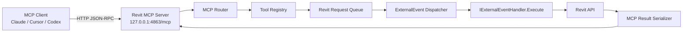
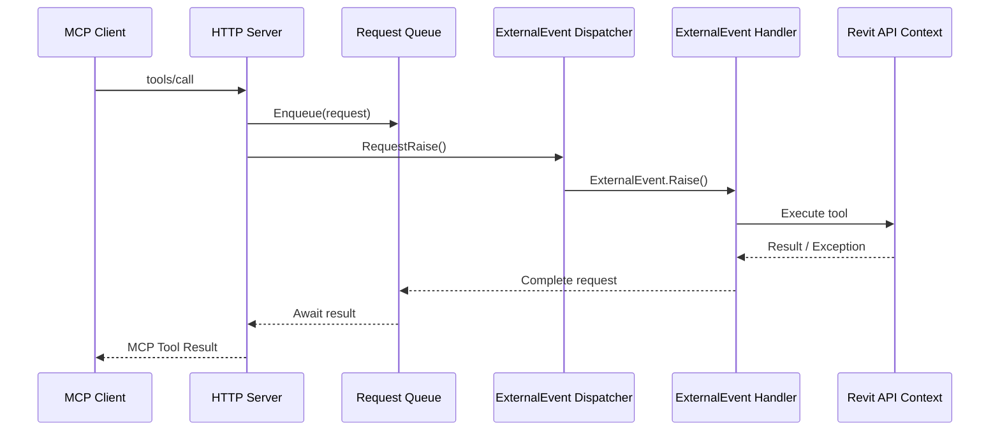
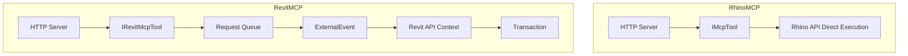

# Revit MCP 実装仕様書

## 1. 文書概要

### 1.1 目的

本書は、Autodesk Revit 上で動作する MCP サーバー `RevitMCP` の実装仕様を定義する。  
狙いは、LLM クライアントから Revit モデルの参照・限定的な更新を安全に実行できるローカル MCP サーバーを、Revit API の実行制約に従って構築することである。

### 1.2 対象範囲

本仕様の対象は以下とする。

- Revit アドインとしての起動・停止・設定読込
- localhost HTTP transport を用いた MCP エンドポイント
- `initialize` / `tools/list` / `tools/call` の実装
- `ExternalEvent` を用いた Revit API 実行キュー
- MVP ツール群の仕様
- セキュリティ、ログ、設定、受け入れ基準

### 1.3 対象外

初期版では以下を対象外とする。

- WebSocket / stdio transport
- リモートホスト公開
- 任意コード実行
- 大量要素一括更新
- 長時間ジョブのバックグラウンド継続実行
- 複数 Revit プロセス間の協調制御

---

## 2. 設計結論

Revit MCP は、**Revit アドイン内で localhost HTTP サーバーを起動し、MCP の `tools/call` を Revit API 実行要求へ変換して `ExternalEvent` 経由で処理する構成** とする。

Rhino 系実装のように HTTP 受信スレッドから直接 CAD API を叩く方式は採用しない。Revit API は UI スレッド文脈での実行が前提であり、HTTP サーバーはあくまで次の責務に限定する。

- HTTP リクエスト受信
- JSON-RPC 解析
- 認証・Origin・入力バリデーション
- Tool 解決
- Revit 実行キュー投入
- 結果待機と MCP レスポンス返却

Revit API 呼び出しはすべて `IExternalEventHandler.Execute(UIApplication app)` 内で実行する。

---

## 3. アーキテクチャ



### 3.1 コンポーネント責務

| コンポーネント | 責務 |
|---|---|
| `App` | Revit アドイン起動、ランタイム初期化、終了処理 |
| `Runtime` | Server、Queue、ExternalEvent、ToolRegistry の構築と所有 |
| `McpHttpServer` | `HttpListener` で localhost リクエストを受信 |
| `McpRouter` | JSON-RPC メソッド分岐、入力検証、レスポンス組み立て |
| `ToolRegistry` | Tool 名から実装を解決し、一覧情報を返す |
| `RevitApiRequestQueue` | Revit 実行待ち要求の保持 |
| `ExternalEventDispatcher` | `ExternalEvent.Raise()` の多重発火制御 |
| `RevitExternalEventHandler` | Revit UI スレッド上で Tool を実行 |
| `AuditLogger` | リクエスト、結果、エラー、実行時間を記録 |

---

## 4. 実行制約と前提

### 4.1 Revit API 制約

- Revit API は HTTP 受信スレッドから直接実行してはならない
- UI 依存 API は `ExternalEvent` 実行文脈でのみ使用する
- モデル変更を伴う処理は `Transaction` が必須
- `UIApplication.ActiveUIDocument` が存在しない場合は、一部 Tool は実行不可

### 4.2 サーバー運用前提

- Listen Address は `127.0.0.1` 固定
- Endpoint は `/mcp`
- 既定ポートは `4863`
- 1 プロセス 1 サーバーを原則とする
- 1 回の Tool 実行は単一ドキュメント文脈に対して行う

### 4.3 ドキュメント文脈前提

- 複数ドキュメントが開いていても、実行対象は `ActiveUIDocument` のみ
- ファミリドキュメントでは一部 Tool を拒否してよい
- ドキュメントが未保存でも read tool は原則許可する

---

## 5. ランタイム構成

### 5.1 推奨プロジェクト構成

```text
RevitMcp/
├─ src/
│  ├─ RevitMcp/
│  │  ├─ App.cs
│  │  ├─ Runtime/
│  │  │  ├─ RevitMcpRuntime.cs
│  │  │  ├─ RuntimeState.cs
│  │  │  └─ ServiceCollectionFactory.cs
│  │  ├─ UI/
│  │  │  ├─ Ribbon.cs
│  │  │  ├─ Commands/
│  │  │  │  ├─ StartServerCommand.cs
│  │  │  │  ├─ StopServerCommand.cs
│  │  │  │  └─ CopyClientConfigCommand.cs
│  │  │  └─ StatusPane.xaml
│  │  ├─ Server/
│  │  │  ├─ McpHttpServer.cs
│  │  │  ├─ McpRouter.cs
│  │  │  ├─ JsonRpcModels.cs
│  │  │  ├─ McpResultFactory.cs
│  │  │  └─ RequestAuthenticator.cs
│  │  ├─ RevitExecution/
│  │  │  ├─ RevitApiRequest.cs
│  │  │  ├─ RevitApiRequestQueue.cs
│  │  │  ├─ ExternalEventDispatcher.cs
│  │  │  ├─ RevitExternalEventHandler.cs
│  │  │  └─ RevitToolContext.cs
│  │  ├─ Tools/
│  │  │  ├─ IRevitMcpTool.cs
│  │  │  ├─ ToolRegistry.cs
│  │  │  ├─ DocumentInfoTool.cs
│  │  │  ├─ SelectionGetTool.cs
│  │  │  ├─ ElementsFindTool.cs
│  │  │  ├─ ElementParametersGetTool.cs
│  │  │  ├─ ElementParameterSetTool.cs
│  │  │  └─ WallCreateLineTool.cs
│  │  ├─ Config/
│  │  │  ├─ RevitMcpSettings.cs
│  │  │  └─ SettingsLoader.cs
│  │  ├─ Logging/
│  │  │  ├─ AuditLogger.cs
│  │  │  └─ LogModels.cs
│  │  └─ Serialization/
│  │     ├─ JsonOptionsFactory.cs
│  │     └─ ToolContentFactory.cs
│  └─ RevitMcp.Tests/
├─ installer/
│  ├─ RevitMcp.addin
│  └─ install.ps1
└─ docs/
   ├─ Revit_MCP_implementation_spec.md
   ├─ client-config.md
   ├─ tools.md
   └─ security.md
```

### 5.2 アドイン構成

`App.cs` は `IExternalApplication` を実装し、Revit 起動時にランタイムを初期化する。

```csharp
using Autodesk.Revit.UI;

namespace RevitMcp;

public sealed class App : IExternalApplication
{
    public Result OnStartup(UIControlledApplication application)
    {
        RevitMcpRuntime.Initialize(application);
        Ribbon.Create(application);
        return Result.Succeeded;
    }

    public Result OnShutdown(UIControlledApplication application)
    {
        RevitMcpRuntime.Shutdown();
        return Result.Succeeded;
    }
}
```

### 5.3 Ribbon 仕様

Ribbon は `AsiaQuest / AI Tools` パネルに以下を配置する。

```text
[AsiaQuest / AI Tools]
  ├─ Start Revit MCP
  ├─ Stop Revit MCP
  ├─ Status
  ├─ Settings
  └─ Copy Client Config
```

---

## 6. サーバー起動・停止ライフサイクル

### 6.1 起動モード

| モード | 動作 |
|---|---|
| Revit 起動時自動開始 | 設定 `enabledOnStartup = true` のとき開始 |
| 手動開始 | Ribbon の `Start Revit MCP` で開始 |
| 手動停止 | Ribbon の `Stop Revit MCP` で停止 |

### 6.2 起動シーケンス

1. 設定ファイル読込
2. Logger 初期化
3. Queue / ToolRegistry / ExternalEvent 作成
4. HTTP Server 起動
5. Ribbon / Status へ起動状態反映

### 6.3 停止シーケンス

1. 新規 HTTP 受付停止
2. 実行待ちキューをキャンセル
3. 実行中リクエストへ停止エラー返却
4. Logger flush
5. Runtime 状態を `Stopped` へ更新

### 6.4 Runtime 状態

```text
Stopped -> Starting -> Running -> Stopping -> Stopped
```

`Status` UI には以下を表示する。

- 現在状態
- Host / Port / Endpoint
- キュー長
- 最終エラー
- 認証設定の有無

---

## 7. MCP Transport 仕様

### 7.1 基本仕様

| 項目 | 内容 |
|---|---|
| Transport | HTTP JSON-RPC |
| URL | `http://127.0.0.1:4863/mcp` |
| Method | `POST` |
| Content-Type | `application/json` |
| 文字コード | UTF-8 |
| Host | `127.0.0.1` 固定 |
| Methods | `initialize`, `tools/list`, `tools/call` |

### 7.2 非対応

- `GET /mcp`
- SSE
- WebSocket
- Batch JSON-RPC request

### 7.3 HTTP ステータス方針

| ケース | HTTP |
|---|---|
| 正常 JSON-RPC 応答 | `200` |
| 認証失敗 | `401` |
| Origin 不許可 | `403` |
| 不正パス | `404` |
| Content-Type 不正 | `415` |
| JSON として解釈不可 | `400` |

JSON-RPC エラーは HTTP `200` で返してよい。ただし、HTTP レベルで解釈不能なリクエストは適切な HTTP エラーを返す。

---

## 8. JSON-RPC / MCP 契約

### 8.1 `initialize`

#### request

```json
{
  "jsonrpc": "2.0",
  "id": 1,
  "method": "initialize",
  "params": {
    "protocolVersion": "2025-06-18",
    "clientInfo": {
      "name": "Codex",
      "version": "1.0.0"
    }
  }
}
```

#### response

```json
{
  "jsonrpc": "2.0",
  "id": 1,
  "result": {
    "protocolVersion": "2025-06-18",
    "capabilities": {
      "tools": {}
    },
    "serverInfo": {
      "name": "revit-mcp",
      "version": "0.1.0"
    }
  }
}
```

### 8.2 `tools/list`

`tools/list` は各 Tool の `name`、`description`、`inputSchema` に加え、実装上の補助として `annotations` を返す。

#### response

```json
{
  "jsonrpc": "2.0",
  "id": 2,
  "result": {
    "tools": [
      {
        "name": "revit.document.get_info",
        "description": "Get information about the active Revit document.",
        "inputSchema": {
          "type": "object",
          "properties": {}
        },
        "annotations": {
          "title": "Get document info",
          "readOnlyHint": true
        }
      }
    ]
  }
}
```

### 8.3 `tools/call`

`tools/call` は Revit 実行を伴う。結果は MCP の Tool Result 形式で返す。

#### request

```json
{
  "jsonrpc": "2.0",
  "id": 3,
  "method": "tools/call",
  "params": {
    "name": "revit.selection.get",
    "arguments": {
      "includeParameters": true
    }
  }
}
```

#### success response

```json
{
  "jsonrpc": "2.0",
  "id": 3,
  "result": {
    "content": [
      {
        "type": "text",
        "text": "Selected 2 element(s)."
      }
    ],
    "structuredContent": {
      "count": 2,
      "elements": [
        {
          "id": 1001,
          "uniqueId": "....",
          "category": "Walls",
          "name": "Basic Wall: Generic - 200mm"
        }
      ]
    },
    "isError": false
  }
}
```

#### error response

```json
{
  "jsonrpc": "2.0",
  "id": 3,
  "result": {
    "content": [
      {
        "type": "text",
        "text": "Active document is not available."
      }
    ],
    "isError": true
  }
}
```

### 8.4 JSON-RPC エラーコード

| ケース | code | message |
|---|---:|---|
| JSON parse failure | `-32700` | Parse error |
| Request shape invalid | `-32600` | Invalid Request |
| Method unknown | `-32601` | Method not found |
| Parameters invalid | `-32602` | Invalid params |
| Internal failure | `-32603` | Internal error |
| Server unavailable | `-32000` | Server unavailable |
| Tool execution timeout | `-32001` | Tool execution timeout |
| Tool not allowed | `-32002` | Tool disabled by policy |

`tools/call` のビジネスエラーは、原則として JSON-RPC `error` ではなく MCP Tool Result の `isError = true` で返す。  
プロトコル違反、認証失敗、ルーター内部障害のみ JSON-RPC `error` を返す。

---

## 9. Tool モデル

### 9.1 Tool インターフェース

```csharp
using System.Text.Json.Nodes;

namespace RevitMcp.Tools;

public interface IRevitMcpTool
{
    string Name { get; }
    string Description { get; }
    object InputSchema { get; }
    ToolAnnotations Annotations { get; }
    ToolAccessLevel AccessLevel { get; }

    McpToolResult Execute(RevitToolContext context, JsonObject? arguments);
}
```

### 9.2 Access Level

| Level | 意味 |
|---|---|
| `Read` | 読み取りのみ。`Transaction` 不要 |
| `Modify` | モデル変更あり。`Transaction` 必須 |
| `Destructive` | 削除や大量変更。初期版は無効 |
| `Dangerous` | 任意コード実行等。初期版は未実装 |

### 9.3 Tool Registry 要件

- Tool 名重複を禁止
- 起動時に全 Tool を登録
- `tools/list` は Registry から生成
- 設定で無効化された Tool は `tools/list` から除外してよい
- 無効 Tool への `tools/call` は `Tool disabled by policy` を返す

---

## 10. Revit 実行モデル

### 10.1 実行シーケンス



### 10.2 `RevitApiRequest`

```csharp
using System.Text.Json.Nodes;

namespace RevitMcp.RevitExecution;

public sealed class RevitApiRequest
{
    public Guid RequestId { get; init; } = Guid.NewGuid();
    public string ToolName { get; init; } = string.Empty;
    public JsonObject Arguments { get; init; } = new();
    public ToolAccessLevel AccessLevel { get; init; }
    public TimeSpan Timeout { get; init; } = TimeSpan.FromSeconds(30);
    public DateTimeOffset CreatedAt { get; init; } = DateTimeOffset.UtcNow;
    public TaskCompletionSource<McpToolResult> Completion { get; init; } = new(TaskCreationOptions.RunContinuationsAsynchronously);
}
```

### 10.3 Queue 要件

- 実装は `ConcurrentQueue<RevitApiRequest>` を基本とする
- キュー長は Status UI に表示する
- 既定最大長は `100`
- 最大長超過時は新規要求を拒否する
- タイムアウト済み要求は実行前に破棄してよい

### 10.4 Dispatcher 要件

`ExternalEvent.Raise()` の多重呼び出しを避けるため、Dispatcher は「pending フラグ」を持つ。

- キュー投入時に `RequestRaise()` を呼ぶ
- すでに Raise 済みなら追加 Raise しない
- `Execute()` 開始時に pending を解除する
- `Execute()` 終了時に未処理要求が残っていれば再度 Raise する

### 10.5 Handler 実行ポリシー

- 1 回の `Execute()` でキューを一定数まで drain する
- 既定 `MaxBatchSize = 10`
- 既定 `MaxExecutionSliceMs = 100`
- 残件があれば再度 `Raise()` して UI 応答性を確保する

### 10.6 `RevitToolContext`

`RevitToolContext` は Tool 実装へ以下を提供する。

- `UIApplication`
- `UIDocument`
- `Document`
- `CancellationToken`
- `RevitMcpSettings`
- `ILogger`

### 10.7 Active Document 不在時

以下の Tool は `ActiveUIDocument` 必須とする。

- `revit.document.get_info`
- `revit.selection.get`
- `revit.elements.find`
- `revit.elements.get_parameters`
- `revit.elements.set_parameter`
- `revit.wall.create_line`

`ActiveUIDocument` が無い場合は `isError = true` で `Active document is not available.` を返す。

---

## 11. Transaction 制御

### 11.1 基本方針

| Tool 種別 | Transaction |
|---|---|
| 読み取り | 不要 |
| 要素作成 | 必須 |
| 要素更新 | 必須 |
| 要素削除 | 必須 |
| View 切替 | 原則不要 |

### 11.2 実行ルール

- `Modify` 以上の Tool は `Transaction` 内で実行する
- Transaction 名は `MCP: {tool.Name}` とする
- 例外発生時は `Rollback()` を試行し、エラー結果を返す
- 部分コミットは許可しない
- 複数要素変更を 1 Tool が扱う場合、初期版では単一 Transaction にまとめる

### 11.3 例外処理

```csharp
if (tool.AccessLevel == ToolAccessLevel.Read)
{
    return tool.Execute(context, request.Arguments);
}

using var tx = new Transaction(context.Document, $"MCP: {tool.Name}");
tx.Start();

try
{
    var result = tool.Execute(context, request.Arguments);
    tx.Commit();
    return result;
}
catch
{
    if (tx.GetStatus() == TransactionStatus.Started)
    {
        tx.RollBack();
    }

    throw;
}
```

---

## 12. データ規約

### 12.1 単位

クライアントと Tool 入出力は人間に扱いやすい単位へ統一する。

| 値種別 | 外部表現 | Revit 内部 |
|---|---|---|
| 長さ | `mm` | `feet` |
| 角度 | `degree` | `radian` |
| Element ID | `integer` | `ElementId` |
| Unique ID | `string` | `Element.UniqueId` |

### 12.2 変換方針

- 長さ入力は `mm` を基本とする
- Revit API 呼び出し直前に feet へ変換する
- 出力値も原則 `mm` に戻す
- 単位が曖昧な値はフィールド名に単位を含める

### 12.3 文字列規約

- Category 名は可能な限り Revit 表示名ではなく API 上の識別子を優先する
- `BuiltInCategory` 指定は `OST_Walls` のような文字列を受ける
- パラメータ名は UI 名称一致を初期版の基本とする

---

## 13. 初期 Tool 一覧

| Tool | 内容 | Access |
|---|---|---|
| `revit.document.get_info` | アクティブドキュメント情報取得 | Read |
| `revit.selection.get` | 選択中要素取得 | Read |
| `revit.elements.find` | 条件検索 | Read |
| `revit.elements.get_parameters` | 要素パラメータ取得 | Read |
| `revit.elements.set_parameter` | 要素パラメータ更新 | Modify |
| `revit.wall.create_line` | 直線壁作成 | Modify |

### 13.1 `revit.document.get_info`

#### input schema

```json
{
  "type": "object",
  "properties": {
    "includeWorksharing": {
      "type": "boolean",
      "default": true
    },
    "includePath": {
      "type": "boolean",
      "default": false
    }
  }
}
```

#### structured content

```json
{
  "title": "SampleProject.rvt",
  "path": "C:\\Projects\\SampleProject.rvt",
  "isFamilyDocument": false,
  "isModified": true,
  "isWorkshared": true,
  "activeView": {
    "id": 12345,
    "name": "Level 1",
    "type": "FloorPlan"
  }
}
```

### 13.2 `revit.selection.get`

#### input schema

```json
{
  "type": "object",
  "properties": {
    "includeParameters": {
      "type": "boolean",
      "default": false
    },
    "parameterLimit": {
      "type": "integer",
      "default": 50,
      "minimum": 1,
      "maximum": 200
    }
  }
}
```

#### structured content

```json
{
  "count": 1,
  "elements": [
    {
      "id": 45678,
      "uniqueId": "....",
      "category": "Walls",
      "name": "Basic Wall: Generic - 200mm"
    }
  ]
}
```

### 13.3 `revit.elements.find`

#### input schema

```json
{
  "type": "object",
  "properties": {
    "category": {
      "type": "string",
      "description": "BuiltInCategory name. Example: OST_Walls"
    },
    "nameContains": {
      "type": "string"
    },
    "parameterEquals": {
      "type": "object",
      "properties": {
        "name": { "type": "string" },
        "value": { "type": "string" }
      }
    },
    "limit": {
      "type": "integer",
      "default": 100,
      "minimum": 1,
      "maximum": 1000
    }
  }
}
```

#### 実装ルール

- `category` 未指定時は全カテゴリ対象
- `nameContains` は大文字小文字を区別しない
- `parameterEquals` は文字列比較の初期実装でよい
- `limit` 超過分は切り捨てる

### 13.4 `revit.elements.get_parameters`

#### input schema

```json
{
  "type": "object",
  "required": ["elementId"],
  "properties": {
    "elementId": { "type": "integer" },
    "includeBuiltIn": {
      "type": "boolean",
      "default": true
    },
    "includeReadOnly": {
      "type": "boolean",
      "default": true
    }
  }
}
```

#### structured content

```json
{
  "elementId": 45678,
  "parameters": [
    {
      "name": "Comments",
      "storageType": "String",
      "isReadOnly": false,
      "value": "demo"
    }
  ]
}
```

### 13.5 `revit.elements.set_parameter`

#### input schema

```json
{
  "type": "object",
  "required": ["elementId", "parameterName", "value"],
  "properties": {
    "elementId": { "type": "integer" },
    "parameterName": { "type": "string" },
    "value": {
      "oneOf": [
        { "type": "string" },
        { "type": "number" },
        { "type": "integer" },
        { "type": "boolean" }
      ]
    }
  }
}
```

#### 実装ルール

- 読み取り専用パラメータは更新不可
- パラメータ未発見時は `isError = true`
- 型変換不能時は `isError = true`
- 単位系が必要な数値パラメータは、初期版では `string` 指定を推奨せず明示数値のみ受ける

### 13.6 `revit.wall.create_line`

#### input schema

```json
{
  "type": "object",
  "required": ["start", "end", "levelName"],
  "properties": {
    "start": {
      "type": "object",
      "required": ["x", "y", "z"],
      "properties": {
        "x": { "type": "number" },
        "y": { "type": "number" },
        "z": { "type": "number" }
      }
    },
    "end": {
      "type": "object",
      "required": ["x", "y", "z"],
      "properties": {
        "x": { "type": "number" },
        "y": { "type": "number" },
        "z": { "type": "number" }
      }
    },
    "levelName": { "type": "string" },
    "wallTypeName": { "type": "string" },
    "heightMm": {
      "type": "number",
      "default": 3000
    }
  }
}
```

#### 実装ルール

- `start` / `end` は `mm`
- `levelName` は完全一致
- `wallTypeName` 未指定時は既定 wall type を利用
- 作成後に新規要素 ID を返す

---

## 14. セキュリティ仕様

### 14.1 ネットワーク境界

| 項目 | 仕様 |
|---|---|
| Listen Address | `127.0.0.1` 固定 |
| Port | 既定 `4863` |
| Remote Access | 禁止 |
| HTTPS | 初期版では不要 |

### 14.2 認証

- 初期版は Bearer Token を任意設定とする
- `requireAuthToken = true` の場合、`Authorization: Bearer <token>` を必須とする
- Token 不一致時は HTTP `401`

### 14.3 Origin 制御

- `Origin` ヘッダが存在する場合のみ検証する
- 許可 Origin 一覧に含まれない場合は HTTP `403`
- 既定許可は `http://localhost` と `http://127.0.0.1`

### 14.4 Tool ポリシー

| 設定 | 意味 |
|---|---|
| `enableWriteTools` | `Modify` Tool を許可 |
| `enableDestructiveTools` | `Destructive` Tool を許可 |
| `enableScriptExecution` | `Dangerous` Tool を許可 |

### 14.5 監査ログ

`tools/call` は全件記録する。

- 受信時刻
- clientInfo
- Tool 名
- 引数要約
- 実行時間
- 成功/失敗
- エラー内容

---

## 15. 設定ファイル仕様

### 15.1 保存先

```text
%APPDATA%\AsiaQuest\RevitMcp\settings.json
```

### 15.2 JSON 例

```json
{
  "server": {
    "enabledOnStartup": false,
    "host": "127.0.0.1",
    "port": 4863,
    "endpoint": "/mcp",
    "requireAuthToken": false,
    "authToken": "",
    "allowedOrigins": [
      "http://localhost",
      "http://127.0.0.1"
    ],
    "requestTimeoutSeconds": 30,
    "maxQueueLength": 100
  },
  "tools": {
    "enableWriteTools": true,
    "enableDestructiveTools": false,
    "enableScriptExecution": false,
    "maxFindElementsLimit": 1000
  },
  "logging": {
    "level": "Info",
    "retentionDays": 14
  }
}
```

### 15.3 設定バリデーション

- `host` は `127.0.0.1` 以外を拒否
- `port` は `1024` 以上 `65535` 以下
- `endpoint` は `/` 始まり必須
- `requestTimeoutSeconds` は `5` 以上 `120` 以下
- `maxQueueLength` は `1` 以上 `1000` 以下

---

## 16. ログ仕様

### 16.1 保存先

```text
%APPDATA%\AsiaQuest\RevitMcp\logs\revit-mcp-yyyyMMdd.log
```

### 16.2 ログ項目

| 項目 | 内容 |
|---|---|
| `timestamp` | ISO8601 |
| `requestId` | `Guid` |
| `jsonRpcId` | クライアント送信 `id` |
| `clientName` | `initialize` 由来の client 名 |
| `method` | JSON-RPC method |
| `toolName` | Tool 名 |
| `durationMs` | 実行時間 |
| `queueWaitMs` | キュー待ち時間 |
| `result` | `success` / `error` |
| `errorMessage` | 失敗時のみ |

### 16.3 ログレベル

| Level | 用途 |
|---|---|
| `Debug` | 開発時の詳細追跡 |
| `Info` | 起動停止、通常実行 |
| `Warn` | タイムアウト、設定異常 |
| `Error` | 例外、復旧不能エラー |

---

## 17. 代表実装例

### 17.1 `RevitExternalEventHandler`

```csharp
using Autodesk.Revit.DB;
using Autodesk.Revit.UI;

namespace RevitMcp.RevitExecution;

public sealed class RevitExternalEventHandler : IExternalEventHandler
{
    private readonly RevitApiRequestQueue _queue;
    private readonly ToolRegistry _toolRegistry;
    private readonly ExternalEventDispatcher _dispatcher;

    public RevitExternalEventHandler(
        RevitApiRequestQueue queue,
        ToolRegistry toolRegistry,
        ExternalEventDispatcher dispatcher)
    {
        _queue = queue;
        _toolRegistry = toolRegistry;
        _dispatcher = dispatcher;
    }

    public void Execute(UIApplication app)
    {
        _dispatcher.OnExecuteStarted();

        var processed = 0;
        var startedAt = DateTime.UtcNow;

        while (_queue.TryDequeue(out var request))
        {
            if (request.CreatedAt + request.Timeout < DateTimeOffset.UtcNow)
            {
                request.Completion.TrySetResult(McpToolResult.Error("Tool execution timeout."));
                continue;
            }

            try
            {
                var tool = _toolRegistry.Get(request.ToolName);
                var context = RevitToolContext.From(app);
                var result = ExecuteTool(tool, context, request);
                request.Completion.TrySetResult(result);
            }
            catch (Exception ex)
            {
                request.Completion.TrySetResult(McpToolResult.Error(ex.Message));
            }

            processed++;

            if (processed >= 10)
            {
                break;
            }

            if ((DateTime.UtcNow - startedAt).TotalMilliseconds >= 100)
            {
                break;
            }
        }

        _dispatcher.OnExecuteCompleted(hasRemainingRequests: !_queue.IsEmpty);
    }

    public string GetName() => "Revit MCP External Event Handler";

    private static McpToolResult ExecuteTool(
        IRevitMcpTool tool,
        RevitToolContext context,
        RevitApiRequest request)
    {
        if (tool.AccessLevel == ToolAccessLevel.Read)
        {
            return tool.Execute(context, request.Arguments);
        }

        using var tx = new Transaction(context.Document, $"MCP: {tool.Name}");
        tx.Start();

        try
        {
            var result = tool.Execute(context, request.Arguments);
            tx.Commit();
            return result;
        }
        catch
        {
            tx.RollBack();
            throw;
        }
    }
}
```

### 17.2 `DocumentInfoTool`

```csharp
using System.Text.Json.Nodes;
using RevitMcp.RevitExecution;

namespace RevitMcp.Tools;

public sealed class DocumentInfoTool : IRevitMcpTool
{
    public string Name => "revit.document.get_info";
    public string Description => "Get information about the active Revit document.";
    public object InputSchema => new
    {
        type = "object",
        properties = new
        {
            includeWorksharing = new { type = "boolean", @default = true },
            includePath = new { type = "boolean", @default = false }
        }
    };

    public ToolAnnotations Annotations => new("Get document info", readOnlyHint: true);
    public ToolAccessLevel AccessLevel => ToolAccessLevel.Read;

    public McpToolResult Execute(RevitToolContext context, JsonObject? arguments)
    {
        var doc = context.Document;
        var uidoc = context.UIDocument;
        var includePath = arguments?["includePath"]?.GetValue<bool>() ?? false;
        var includeWorksharing = arguments?["includeWorksharing"]?.GetValue<bool>() ?? true;

        return McpToolResult.Success(
            text: $"Active document: {doc.Title}",
            structuredContent: new
            {
                title = doc.Title,
                path = includePath ? doc.PathName : null,
                isFamilyDocument = doc.IsFamilyDocument,
                isModified = doc.IsModified,
                isWorkshared = includeWorksharing && doc.IsWorkshared,
                activeView = new
                {
                    id = uidoc.ActiveView.Id.IntegerValue,
                    name = uidoc.ActiveView.Name,
                    type = uidoc.ActiveView.ViewType.ToString()
                }
            });
    }
}
```

---

## 18. 実装フェーズ

### Phase 1: MCP 基盤

| 優先 | 機能 |
|---|---|
| P0 | Revit アドイン起動 |
| P0 | Ribbon ボタン |
| P0 | 設定読込 |
| P0 | HTTP Server |
| P0 | `initialize` |
| P0 | `tools/list` |
| P0 | `tools/call` |
| P0 | `ExternalEvent` キュー |
| P0 | 監査ログ |

### Phase 2: MVP Tool

| 優先 | 機能 |
|---|---|
| P0 | `revit.document.get_info` |
| P0 | `revit.selection.get` |
| P0 | `revit.elements.find` |
| P1 | `revit.elements.get_parameters` |
| P1 | `revit.elements.set_parameter` |
| P1 | `revit.wall.create_line` |

### Phase 3: 実用拡張

| 優先 | 機能 |
|---|---|
| P1 | `revit.views.list` |
| P1 | `revit.views.activate` |
| P2 | QA 用 read tool 群 |
| P2 | Room / Space 関連検索 |
| P2 | Mark 重複チェック |
| P3 | Dynamo 連携 |

---

## 19. テスト戦略

### 19.1 単体テスト

- `McpRouter` の JSON-RPC ルーティング
- `RequestAuthenticator` の token / origin 判定
- `ToolRegistry` の登録重複検知
- `McpResultFactory` の MCP 結果生成
- 設定バリデーション

### 19.2 疑似統合テスト

- Queue へ投入したリクエストが完了まで遷移すること
- Dispatcher の pending 制御が過剰 Raise を防ぐこと
- timeout リクエストが適切に失敗すること
- write tool が `Transaction` 経由で実行されること

### 19.3 手動検証

- Revit 起動後に Ribbon が表示される
- Server の開始停止ができる
- `tools/list` がクライアントから参照できる
- read tool がアクティブドキュメントを返す
- write tool がモデルへ反映される
- 例外発生時に Revit がクラッシュしない

---

## 20. 受け入れ基準

### 20.1 起動・停止

| ID | 条件 | 期待結果 |
|---|---|---|
| AC-001 | Revit 起動 | Ribbon に Revit MCP ボタンが表示される |
| AC-002 | Start 実行 | `127.0.0.1:4863/mcp` が起動する |
| AC-003 | Status 表示 | 稼働状態、ポート、キュー長が見える |
| AC-004 | Stop 実行 | 新規リクエスト受付が停止する |

### 20.2 MCP 基盤

| ID | 条件 | 期待結果 |
|---|---|---|
| AC-101 | `initialize` | `serverInfo` と `protocolVersion` が返る |
| AC-102 | `tools/list` | 利用可能 Tool 一覧が返る |
| AC-103 | 認証無効時 | Token なしでも実行できる |
| AC-104 | 認証有効時 | 不正 Token は `401` になる |

### 20.3 Revit 実行

| ID | 条件 | 期待結果 |
|---|---|---|
| AC-201 | `revit.document.get_info` | 現在の文書情報が返る |
| AC-202 | `revit.elements.find` | 条件一致要素が返る |
| AC-203 | write tool 実行 | `Transaction` 内で変更される |
| AC-204 | 例外発生 | Revit は継続動作し、MCP 側へ失敗が返る |
| AC-205 | Active document 不在 | `isError = true` で失敗を返す |

### 20.4 安全性

| ID | 条件 | 期待結果 |
|---|---|---|
| AC-301 | HTTP 受信スレッド | Revit API を直接呼ばない |
| AC-302 | Remote host から接続 | 受け付けない |
| AC-303 | destructive tool 無効 | 実行拒否される |
| AC-304 | 監査ログ確認 | `tools/call` の記録が残る |

---

## 21. RhinoMCP との差分



| 観点 | RhinoMCP | RevitMCP |
|---|---|---|
| API 呼び出し | 比較的直接的 | `ExternalEvent` 経由必須 |
| 更新処理 | オブジェクト操作中心 | `Transaction` 必須 |
| モデル概念 | Geometry 中心 | Element / Parameter / View 中心 |
| 危険操作 | スクリプト実行を拡張しやすい | 初期版では未実装 |
| UI | Command ベース | Ribbon + Status |

---

## 22. 実装判断まとめ

本仕様で採用する主要判断は以下とする。

| 項目 | 採用値 |
|---|---|
| Server 形態 | Revit アドイン内 HTTP server |
| Host | `127.0.0.1` 固定 |
| Port | `4863` |
| Endpoint | `/mcp` |
| API 実行 | `ExternalEvent` 経由 |
| 更新処理 | `Transaction` 必須 |
| Tool 結果 | MCP Tool Result 形式 |
| 初期 Tool | 6 個 |
| 任意コード実行 | 初期版対象外 |
| Destructive tool | 初期版無効 |

この仕様により、MCP クライアント互換性を保ちながら、Revit API のスレッド制約とモデル更新制約に適合した実装へ着手できる。
